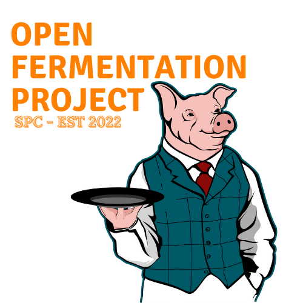
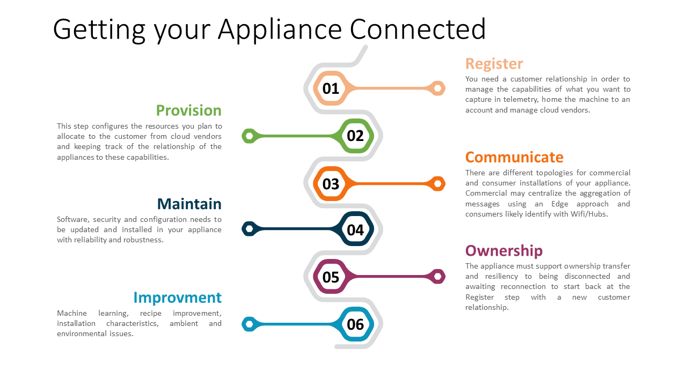

&nbsp;&nbsp;&nbsp;

# The Cloud

## Contents

- [Overview](#overview)
  - [Connecting Your Saluminator](#connecting-your-saluminator)
  - [Device Lifecycle](#device-lifecycle)
    - [Register](#register)
    - [Provision](#provision)
    - [Communicate](#communicate)
    - [Maintain](#maintain)
    - [Ownership](#ownership)
    - [Improvement](#improvement)
  - [The Cloud Management Interface](#the-cloud-management-interface)
    - [Connectivity Panel](#connectivity-panel)
      - [Ethernet Wired Status](#ethernet-wired-status)
      - [Wifi Status and Strength of Signal](#wifi-status-and-strength-of-signal)
      - [Cloud Connected](#cloud-connected)
      - [Connected to Azure IoT Central](#connected-to-azure-iot-central)
    - [Status Panel](#status-panel)
      - [Registered](#registered)
      - [Versioning](#versioning)
      - [Logging](#logging)

## Overview

The Open Fermentation Project and the Saluminator were designed with the integration to the cloud as a fundemental capability that enabled visualizations of the recipe lifecycle, capture and export telemetry to improve curing and bring that data together from the community.

## Connecting Your Saluminator

The **Saluminator Appliance** features a range of connectivity options designed to constantly improve your fermentations and automate your specific chamber characteristics over time. Your appliance will communicate with Salumi.Cloud and optionally with your preferred cloud vendor to integrate the Telemetry, Recipes and Predictive Maintenance, all from our intuitive user interface.

The infographic below outlines the flow and lifecycle of the Saluminator Appliance. We will dig into each item in detail and how the **Open Fermentation Project** sustains connected devices...

## Device Lifecycle

There are a number of important concepts to be familiar with that we outline in **Getting Your Appliance Connected** and it represents the lifecycle of the appliance. We designed the connectivity of the appliance to make it easy to see the progress of recipes, health of the appliance with metrics, security and frictionless updates to the system software.

- ### Register

  The Saluminator is registered with Salumi.Cloud in order to manage the capabilities, configure and setup the digital Twin models for telemetry, properties and commands. This process also keeps track of your appliances, cloud vendor accounts and ownership.

- ### Provision

  Provisioning configures the resources and associates to your account cloud capabilities and links the relationship of the appliances to these services like Telemetry, Properties, Updates, etc

- ### Communicate

  Connection to the Interwebs. Configuration of Wifi, Networking, Connection Protocols and Edge Aggregation scenarios

- ### Maintain

  Software, security and configuration needs to be updated and installed in your appliance with reliability and robustness.

- ### Ownership

  The appliance must support ownership transfer and resiliency to being disconnected and awaiting reconnection to start back at the Register step with a new customer relationship.

- ### Improvement

  Machine learning, recipe improvement, installation characteristics, ambient and environmental issues.

## The Cloud Management Interface

The software and user interface on Saluminator Appliance provides a series of panels for configuration of the following parameters and they are indicated in the main screen via icons that provide the status of the option.

### Connectivity Panel

The Saluminator indicates the connectivity options that are enabled and communicating on the front panel of the appliance.

- #### Ethernet Wired Status

  Indicates that network connectivity is present. Just plug in the ethernet cable to an active network.

- #### Wifi Status and Strength of Signal

  The Saluminator supports Wifi connectivity.

- #### Cloud Connected

  Indicates that the Saluminator IoT Automation software is communicating with the salumi.cloud API’s to send telemetry and receive machine learning optimizations.

- #### Connected to Azure IoT Central

  Indicates that the Saluminator IoT Automation software is communicating with Microsoft’s Azure IoT Central. This optional capability sends real time telemetry for time series monitoring of the recipe cycles, progress and remote monitoring.

### Status Panel

The Saluminator Product Status Connectivity panel gives you a reference on the status of the Saluinator connection to Salumi.Cloud services.

- #### Registered

  Indicates your Saluminator is connected and registred with Salumi.Cloud. This provides the logging ability, updates and machine learning.

- #### Versioning

  The Saluminator compares the software version on your appliance with the latest release available from Salumi.Cloud.

- #### Logging

  View logging history, alerts and service outages.

## AZURE IOT CENTRAL

The Saluiminator has optional capabilities to connect and seamlessly integrate your appliance with Microsoft's Azure IoT Central subscription offering. Azure IoT Central provides scalable telemetry processing and visualizations, data export and connected communications with your Salmuninator. Learn More...

## TELEMETRY FEATURES

Each time the Samulinator takes a reading of a sensor, the data is sent to Azure IoT Central to record the values. This keeps an ongoing record of things like temperature and humidity readings.

- ### State Changes

  The Saluminator tracks the changes associated with the AC Relays that toggle the Humidifier, Dehumifier, Chiller and Heater. This data is aggregated along with the telemetry to support machine learning to create the perfect ambiance in the curing chamber.

- ### Tracking Events

  We track overrides, shut downs, restarts and other signficant events for the Saluminator.

## RECIPE REPORTING

- ### Incubation Started

  The date and time that the Incubate phase STARTED.

- ### Incubation Ended

  The date and time that the Incubate phase ENDED.

- ### Incubation Percentage Completed

  The amount of completion for the Incubate phase relative to the current date and time.

- ### Cure Started

  The date and time that the Cure phase STARTED.

- ### Cure Ended The date and time that the Cure phase ENDED.

  The date and time that the Cure phase STARTED.

- ### Cure Percentage Completed

  The amount of completion for the Cure phase relative to the current date and time.

- ### Finish Started

  The date and time that the Finish phase STARTED. Cure Ended The date and time that the Cure phase ENDED.

- ### Finish Percentage Completed

  The amount of completion for the Finish phase relative to the current date and time.

- ### Checkpoint Hour

  Checkpoint pointer to the exact hour that the Salumintor is at for the whole recipe cycle.

- ### Last Reported from Device

  The date and time that the last sending of the properties data from the Saluminator.
