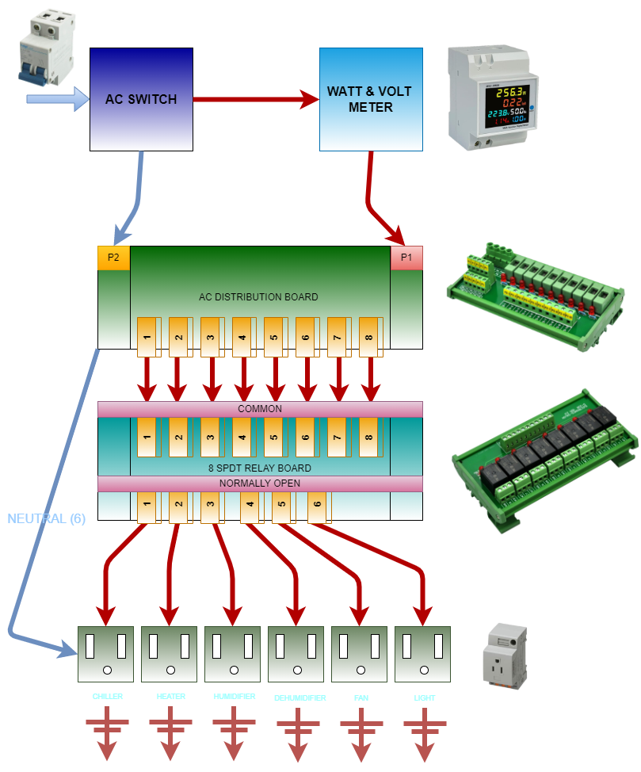
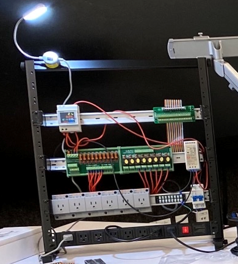

&nbsp;&nbsp;&nbsp;

# The Hardware A/C Path

## Overview

Let's walk through the configuration of the A/C path of electricity for the Saluminator&reg; System...

* A/C comes in via the Main Switch
* Live wire is passed through the A/C Wattage and Voltage Monitoring Component
* Live Wire is Connected to the P2 connection on the A/C Distribution and Fuse Board
* Live Wires (8) are Connected to the 8 Way Relay Board (Common)
* Live Wires (6) are Connected to the Normally Open Output of the Relay Board to the Live Connection for each A/C Plug
* Neutral Wire is Connected from the Main Switch to the P1 connection on the A/C Distribution and Fuse Board
* Neutral Wires(6) are Connected via the  for each A/C Plug
* Each A/C Plug Ground is Connected to Common Ground

Here is a view of just this part of the assembly of the hardware...

