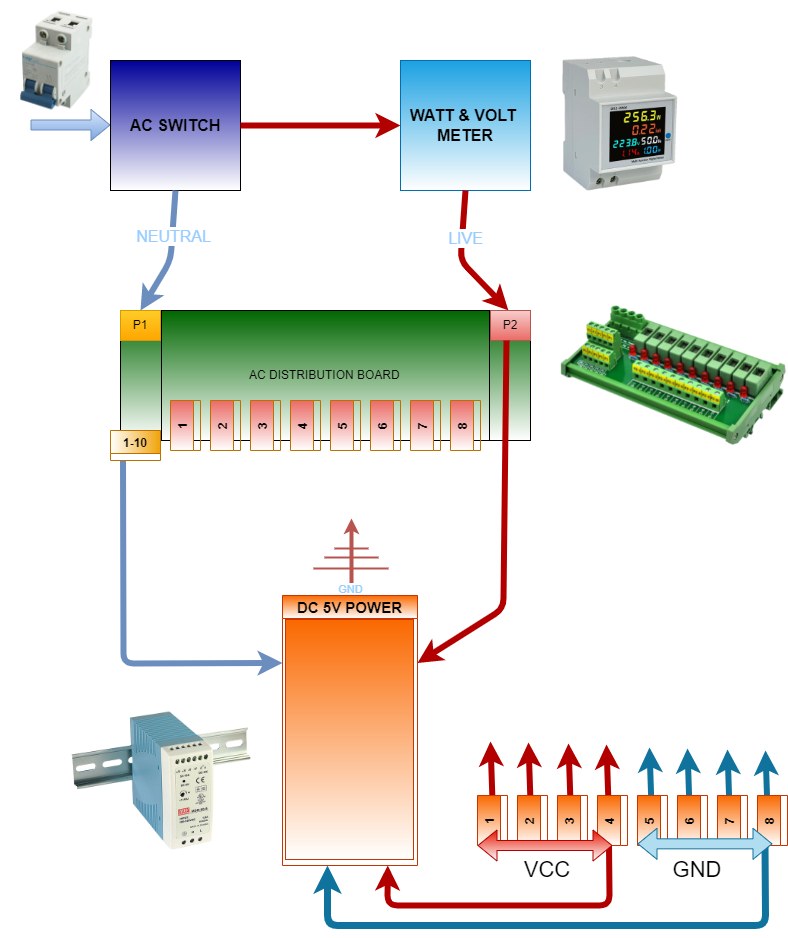

&nbsp;&nbsp;&nbsp;

# The Hardware D/C Path

## Overview

Let's walk through the configuration of the A/C path of electricity for the Saluminator&reg; System...

- A/C comes in via the Main Switch
- Live wire is passed through the A/C Wattage and Voltage Monitoring Component
- Live Wire is Connected to the P2 connection on the A/C Distribution and Fuse Board
- Live Wire from P2 is Connected to the DC Power Block Live Wire Connection
- Nuetral Wire from P1 is Connected to the DC Power Block Nuetral Wire Connection
- DC Power Block Ground is Connected to Common Ground
- Live VCC 5V DC is connected to Passive Distribution Block
- Ground GND 5V DC is connected to Passive Distribution Block

