&nbsp;&nbsp;&nbsp;

# The Hardware

## Contents

- [The Software (Overview)](#the-software)
  - [Recipe Phases](#recipe-phases)
    - [Incubation](#incubation)
    - [Curing](#curing)
    - [Finishing](#finishing)
  - [Managing Recipes](#managing-recipes)
  - [Recipe Parameters](#recipe-parameters)
    - [Temperature](#temperature)
    - [Temperature Variance](#temperature-variance)
    - [Temperature Run Time](#temperature-run-time)
    - [Temperature Idle Time](#temperature-idle-time)
    - [Humidity](#humidity)
    - [Humidity Variance](#humidity-variance)
    - [Humidity Run Time](#humidity-run-time)
    - [Humidity Idle Time](#humidity-idle-time)
    - [Cycle Time Toggle](#cycle-time-toggle)
    - [Cycle Time](#cycle-time)

## Overview

We developed this appliance to bring precision curing and fermentation to home and custom curing chambers. The entire project is based on “open source” software and “open and available” components that anyone with basic engineering skills could put together our system. We share this all with you and you are welcome to just use the instructions here to build your system and/or we are happy to sell you everything you need from a complete DIY kit to everything fully assembled and ready to install.

We designed the Saluminator for the production of fermented products and specifically for the automation of dry curing meats and other recipes that require control over temperature, humidity and time. Connected to the power of the cloud and through the acquisition of stream telemetry and machine learning, the Saluminator IoT Automation tunes itself to variances in the ambient environment and the characteristics of your specific curing chamber

The Saluminator Appliance was designed to be put together using commodity, DIN mounted components that anyone with basic electrical and software skills can build one of our systems. This document provides all of the needed materials and wiring schematics to build yoiur own wall mounted system and get started with precision fermentations.

## Hardware Bill of Materials

| Image                                                                | Item                           | Quantity | Amazon Link                                                                                                                                                                                                                                                                                                                                                                                                                                                        |
| -------------------------------------------------------------------- | ------------------------------ | -------- | ------------------------------------------------------------------------------------------------------------------------------------------------------------------------------------------------------------------------------------------------------------------------------------------------------------------------------------------------------------------------------------------------------------------------------------------------------------------ |
| 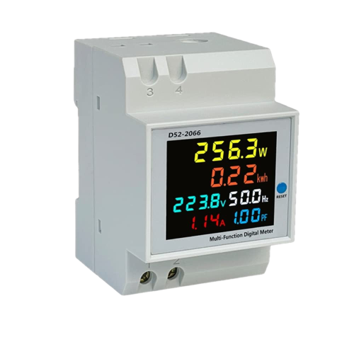      | Votage Usage Monitor           | 1        | [View on Amazon](https://www.amazon.com/gp/product/B094F98PYF/ref=ppx_yo_dt_b_search_asin_title?ie=UTF8&psc=1)                                                                                                                                                                                                                                                                                                                                                     |
| 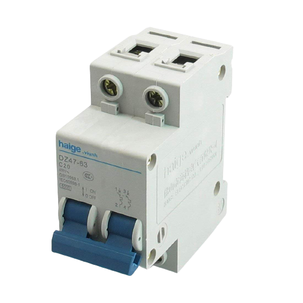 | Miniature Circuit Breaker      | 1        | [View on Amazon](https://www.amazon.com/gp/product/B07JCDR17D/ref=ppx_yo_dt_b_search_asin_title?ie=UTF8&psc=1)                                                                                                                                                                                                                                                                                                                                                     |
| 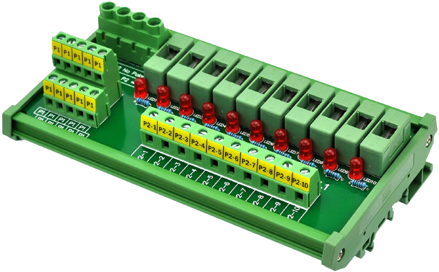      | Power Distribution Fuse Module | 1        | [View on Amazon](https://www.amazon.com/gp/product/B01FCVZ3JE/ref=ppx_yo_dt_b_search_asin_title?ie=UTF8&psc=1)                                                                                                                                                                                                                                                                                                                                                     |
| 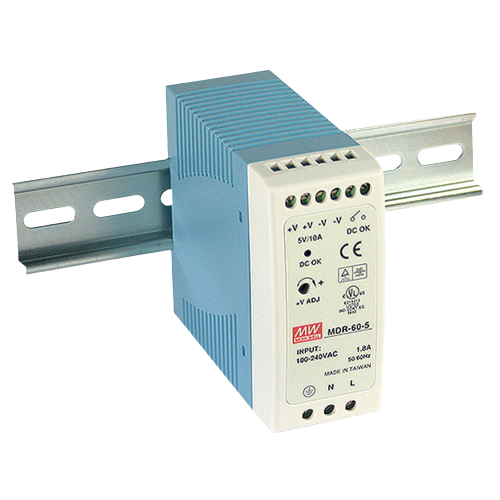         | AC to DC Power Supply 5V       | 1        | [View on Amazon](https://www.amazon.com/gp/product/B005T6SAJI/ref=ppx_yo_dt_b_search_asin_title?ie=UTF8&th=1)                                                                                                                                                                                                                                                                                                                                                      |
| 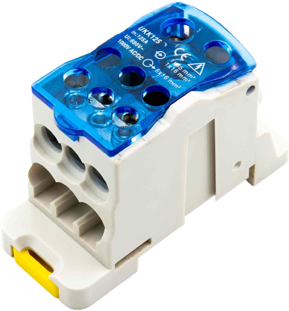      | Power Distribution Block       | 1        | [View on Amazon](https://www.amazon.com/gp/product/B08LHGVS7N/ref=ppx_yo_dt_b_search_asin_image?ie=UTF8&psc=1)                                                                                                                                                                                                                                                                                                                                                     |
| 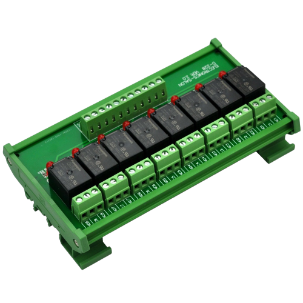         | 8 SPDT Power Relay             | 1        | [View on Amazon](https://www.amazon.com/gp/product/B00M1MC3ZU/ref=ppx_yo_dt_b_search_asin_image?ie=UTF8&psc=1)                                                                                                                                                                                                                                                                                                                                                     |
| 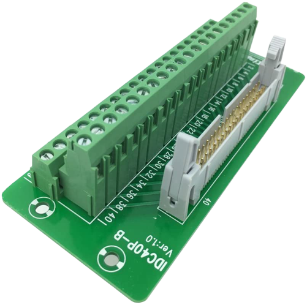 | Header Breakout Board          | 1        | [View on Amazon](https://www.amazon.com/gp/product/B074THMST3/ref=ppx_yo_dt_b_search_asin_title?ie=UTF8&psc=1)                                                                                                                                                                                                                                                                                                                                                     |
| 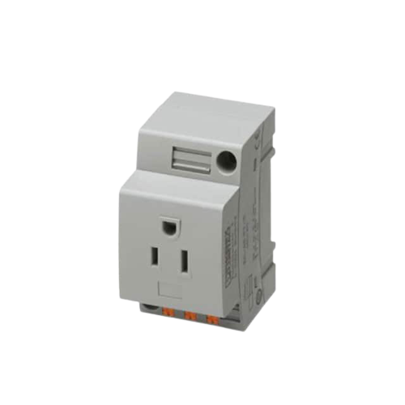         | AC Plug Rail Mount             | 6        | [View on DigiKey](https://www.digikey.com/en/products/detail/phoenix-contact/0804165/10449732)                                                                                                                                                                                                                                                                                                                                                                     |
| 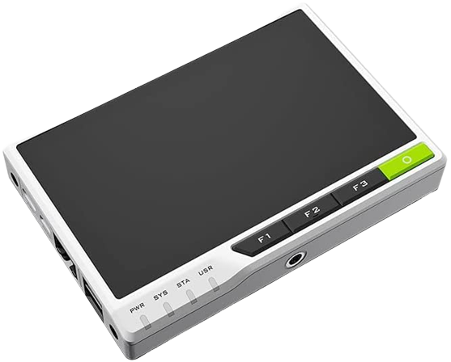     | Seeed Studio reTerminal        | 1        | [View on Amazon](https://www.amazon.com/Seeed-Studio-reTerminal-Multi-Touch-Connectivity/dp/B096ZXDRK9/ref=sr_1_1_sspa?crid=25NOBLG3NBI5Z&keywords=seeed%2Breterminal&qid=1644895981&sprefix=seeed%2Bre%2Caps%2C165&sr=8-1-spons&spLa=ZW5jcnlwdGVkUXVhbGlmaWVyPUEyMlBORlhZQlRTQlpIJmVuY3J5cHRlZElkPUEwMjI3MTA3M1E2RFZETjhKMldNMCZlbmNyeXB0ZWRBZElkPUEwNDY4NjU0SzZHMU0yMFFVQzc2JndpZGdldE5hbWU9c3BfYXRmJmFjdGlvbj1jbGlja1JlZGlyZWN0JmRvTm90TG9nQ2xpY2s9dHJ1ZQ&th=1) |

## Wiring

The wiring of the Samluminator is accomplished using flexible, tough silicon wire and connected to the components using ferrule and crimping technique that is robust, reliable and very easy to acheive a professional result.

### Ferrules

The ferrules are sized based on the wire gauge you are using. You cut the wire, strip the end, insert into the ferrule and then using the tool, compress it to crimp the ferrule to the wire.

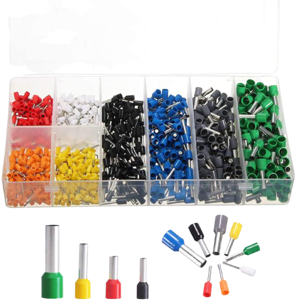

[View on Amazon](https://www.amazon.com/gp/product/B07DWQ34QR/ref=ppx_yo_dt_b_search_asin_title?ie=UTF8&psc=1)

### Wire Ferrule Crimping Tool

Wire ferrule crimping tool is used to terminate bootlace ferrule with stranded wire for insertion into terminal blocks and provide superior termination performance.

[View on Amazon](https://www.amazon.com/IWISS-Self-adjusting-Hexagonal-AWG23-10-End-sleeves/dp/B00H950AK4/ref=pd_bxgy_1/133-1670461-0417717?pd_rd_w=LbGxv&pf_rd_p=6b3eefea-7b16-43e9-bc45-2e332cbf99da&pf_rd_r=MD0HCV4WACCEFB882M6R&pd_rd_r=e6f5cbed-6ce5-440c-9a1d-14d2de9da7a1&pd_rd_wg=aTqDM&pd_rd_i=B00H950AK4&psc=1)

### Wiring Schematic for AM2315 Sealed Temperature and Humidity Sensor

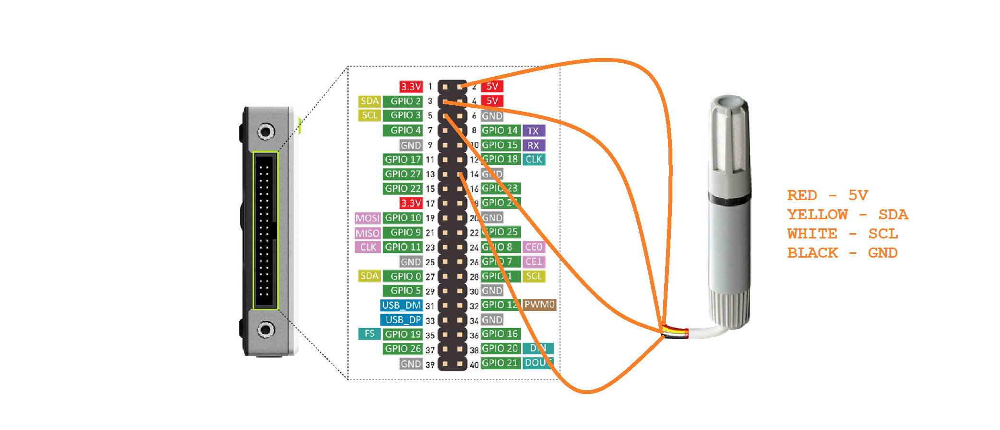

### Wiring Schematic for 8 Relay Board for AC Control

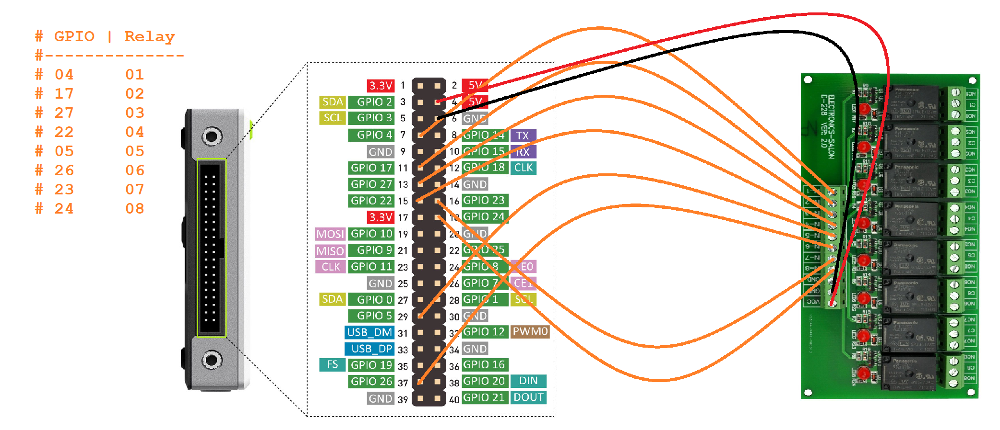
