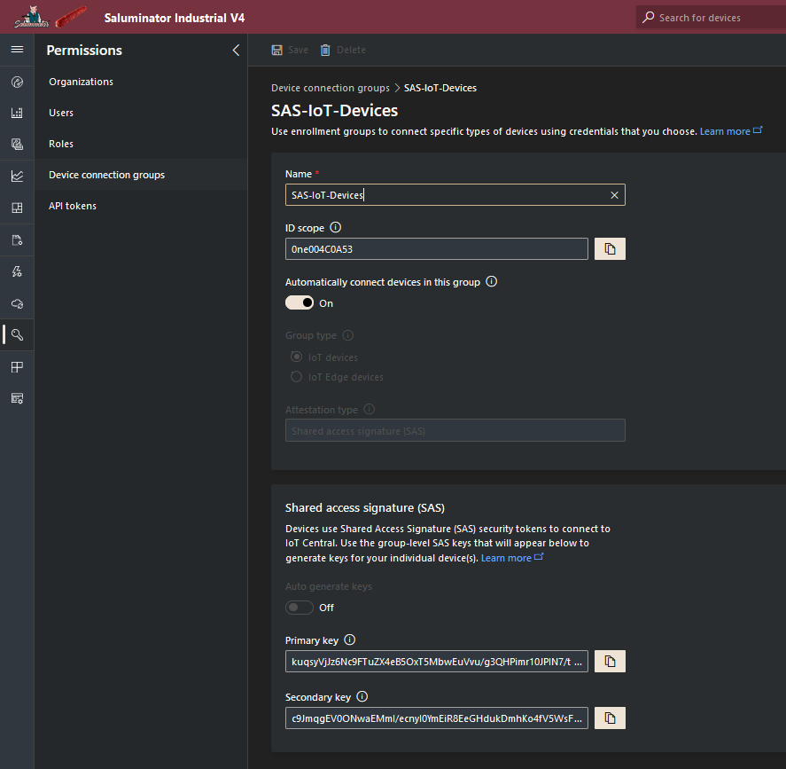

[](https://www.gnu.org/licenses/gpl-3.0)&nbsp;<a href="https://www.open-fermentation-project.org/"></a>&nbsp;<a href="https://apps.azureiotcentral.com/">
</a>&nbsp;<a href="https://www.saluminator.com/">
</a>


# System Configuration Files

## <a name='Contents'></a>Contents

<!-- vscode-markdown-toc -->

- [Contents](#Contents)
- [Overview](#Overview)
- [Config](#Config)
  _ [Main Section](#MainSection)
  _ [Device Section](#DeviceSection)
  _ [Status Section](#StatusSection)
  _ [Relays Section](#RelaysSection)
- [Alerts](#Alerts)
- [Secrets](#Secrets)

<!-- vscode-markdown-toc-config
	numbering=false
	autoSave=true
	/vscode-markdown-toc-config -->
<!-- /vscode-markdown-toc -->

## <a name='Overview'></a>Overview

This document outlines all of the configuration options for the Saluminator&reg; device and scripts.

## <a name='Config'></a>Config

- **FILE**: <a href="./src/config.json">config.json</a>
- **LOCATION**: ./software/src/config.json

This is the core configuration file for the Saluminator&reg; System. Let's go through all of the details from the top of the file and work our way down...

#### <a name='MainSection'></a>Main Section

```json
  "AppName": "SaluminatorV4",
  "Description": "Monitoring of Saluminator Fermentation System",
```

The **AppName** and **Description** are used as an overall way to identify the software in scripts and error messages. It can be any string value you want. For example, when you run scripts with the _--verbose_ or _--debug_ options, you will get a header and error messages with the app name and description.

```json
  "Enable Cloud Telemetry", true,
  "Telemetry Frequency In Seconds": 60,
  "Read Delay In Seconds": 5,
```

The **Enable Cloud Telemetry** option is true/false and indicates if the telemetery loop will send the data to Azure IoT Central.

The **Telemetry Frequency In Seconds** defines how frequently the telemetery loop is engaged to read the temperature and humidity (ambient and the chamber) and act on the data (engage the relays) and optionally to send the telemetry to the cloud based on the **Enable Cloud Telemetry** setting. This is an important setting as charges can be incurred when sending messages to the cloud and you want to be effecient and also generate enough data for proper visualizations.

The **Read Delay In Seconds** in used to place a pause after reading the ambient and chamber temperature and humidity sensors. This compensates in the telemetery loop for errors that the sensors may raise and adds the seconds to the overall loop time. The default is 5 and unless you are debugging, it is rarely needed.

```json
  "Temperature Format": "F",
```

The **Temperature Format** is used to indicate Fahrenheit (F) or Celsius (C) when monitoring the ambient and chamber temperature readings.

```json
  "Database Naming Pattern": "active_recipe_{recipe_name}.db",
```

The **Database Naming Pattern** is a string pattern that is used to insert the _recipe name_ into the file name to make it easy to understand the database from the file name. This value must exist in the recipes.json file and this relationship is explanined in the [Create Recipe Database](./IOTCENTRAL.MD) document.

```json
  "Correct Recipe Checkpoint Drift": true,
```

The **Correct Recipe Checkpoint Drift** is an important option that affects the way in which a recipe is _restarted_ after you monitoring has been interrupted for an active recipe. This could be because you stopped it manually or a power outage, etc.

#### <a name='DeviceSection'></a>Device Section

```json
  "Device": {
    "Device Name Prefix": "saluminator-{id}",
    "NameSpace": "saluminatorIndustrialV4",
    "Default Component Id": "dtmi:saluminatorIndustrialV4:Saluminator;1"
  },
```

The **Device Name Prefix** indicates the string that prefix your provisioned device in Azure IoT Central. For example, when you run the _provisiondevice.py_ script with the option --registerid set to '1', it would result in a device provisioned with the name: saluminator-1. You can read more detail on this in the [Provision Device to Azure IoT Central](./PROVISION.MD) document.

The **NameSpace** value is used to indicate the unique _namespace_ when communicating to IoT Central and in modeling for mapping to telemetry. This is covered in depth in the [Azure IoT Central](./IOTCENTRAL.MD) document.

The **Default Component Id** is the Id for the assigned device model in Azure IoT Central. This is covered in depth in the [Azure IoT Central](./IOTCENTRAL.MD) document.

#### <a name='StatusSection'></a>Status Section

The status section wires up an optional RGB Led for flashing status during the telemetry loop.

```json
  "Status": {
    "Pins": {
      "Red": 5,
      "Green": 6,
      "Blue": 16
    }
  },
```

#### <a name='RelaysSection'></a>Relays Section

The **Relays** section indicates the GPIO (BCM) pins that signal the ON/OFF to the _Relay_ board.

```json
  "Relays": {
    "Pins": {
      "Humidifier": 6,
      "DeHumidifier": 17,
      "Heater": 27,
      "Chiller": 22,
      "Fan": 5,
      "Light": 26,
      "Open1": 23,
      "Open2": 24
    }
  },
```

```json
  "AmbientPin": 25
```

## <a name='Alerts'></a>Alerts

- **FILE**: <a href="./src/alerts.json">alerts.json</a>
- **LOCATION**: ./software/src/alerts.json

The _alerts.json_ file contains strings that are used when we execute scripts with the _--verbose_ and _--debug_ options.

```json
{
  "Alerts": {
    "Config": {
      "Loaded": "Loaded Config file: {0}",
      "Updated": "Updated Config file: {0}",
      "Dump": "Dumped Config file: {0}"
    },
    "DPSCache": {
      "Loaded": "Loaded DPS Cache file: {0}",
      "Updated": "Updated DPS Cache file: {0}",
      "Dump": "Dumped Config file: {0}"
    },
    "DeviceCache": {
      "Loaded": "Loaded Device Cache file: {0}",
      "Updated": "Updated Device Cache file: {0}",
      "Dump": "Dumped Config file: {0}"
    },
    "Secrets": {
      "Loaded": "Loaded Secrets file: {0}",
      "Updated": "Updated Secrets file: {0}",
      "Dump": "Dumped Config file: {0}"
    },
    "DcmTemplate": {
      "Loaded": "Loaded DCM Template file: {0}",
      "Updated": "Updated DCM Template file: {0}",
      "Dump": "Dumped Config file: {0}"
    }
  }
}
```

- **Loaded**
  Prints to the console or logging the string along with the FQN file name.

- **Updated**
  Prints to the console or logging the string along with the FQN file name.

- **Dump**
  Prints to the console or logging the string along with the contents of the file.

## <a name='Secrets'></a>Secrets

- **FILE**: <a href="./src/secrets.json">secrets.json</a>
- **LOCATION**: ./software/src/secrets.json

The first step to setting up your secrets file is to copy the template and create the secrets.json file in the /src folder. Execute the following from the _/software/src_ folder...

```bash
cp secrets_template.json secrets.json
```

Open the _secrets.json_ file in Visual Studio Code and let's start configuring the options.

**IMPORTANT: Make sure to check your .gitignore to verify that "secrets.json" is in the exclusion list and that it does not get checked in!**
_The file should be dithered in your Visual Studio Code Explorer window._

Set "UseKeyVault" to false and fill out the section "LocalSecrets" and populate the SaS key values from your application via the Admin, Device Connection page in IoT Central. If you want to get deeper into connecting Devices to IoT Central, go here: [LINK: Get connected to Azure IoT Central](https://docs.microsoft.com/en-us/azure/iot-central/core/concepts-get-connected)

You fill in the values into the "secrets.json" file with the pasted values from IoT Central Device Connection page.

**For example...**

```json
  "ScopeId": "<Your Scope ID from IoT Central Device Connect Page>"
```


Copy the value from the ScopeId field (outlined in red) and paste the value into the Json

```json
  "ScopeId": "0ne001F823C"
```

Complete this for the "Primary" and "Secondary" values for both "DeviceConnect->SaSKeys" and "GatewayConnect->SaSKeys"

```json
{
  "UseKeyVault": false,
  "ProvisioningHost": "global.azure-devices-provisioning.net",
  "LocalSecrets": {
    "ScopeId": "<Your Scope ID from IoT Central Device Connect Page>",
    "DeviceConnect": {
      "SaSKeys": {
        "Primary": "<Your Primary Key from IoT Central Device Connect Page>",
        "Secondary": "<Your Secondary Key from IoT Central Device Connect Page>"
      }
    },
    "GatewayConnect": {
      "SaSKeys": {
        "Primary": "<Your Gateway Primary Key from IoT Central Device Connect Page>",
        "Secondary": "<Your Gateway Secondary Key from IoT Central Device Connect Page>"
      }
    }
  },
  "KeyVaultSecrets": {
    "KeyVaultUri": "",
    "TenantId": "",
    "ClientId": "",
    "ClientSecret": "",
    "ScopeId": "",
    "DeviceConnect": {
      "SaSKeys": {
        "Primary": "",
        "Secondary": ""
      }
    },
    "GatewayConnect": {
      "SaSKeys": {
        "Primary": "",
        "Secondary": ""
      }
    }
  },
  "Device": {
    "Secrets": {}
  }
}
```
