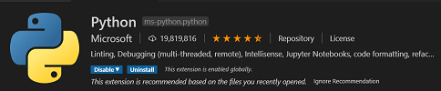
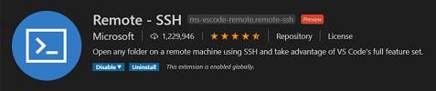
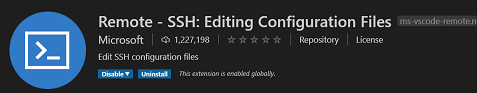

[](https://www.gnu.org/licenses/gpl-3.0)&nbsp;<a href="https://www.open-fermentation-project.org/"></a>&nbsp;<a href="https://apps.azureiotcentral.com/">
</a>&nbsp;<a href="https://www.saluminator.com/">
</a>


# Setting up the Environment

## Contents

<!-- vscode-markdown-toc -->

- [System Configuration Files](#system-configuration-files)
  - [Contents](#contents)
  - [Overview](#overview)
  - [Config](#config)
    - [Main Section](#main-section)
    - [Device Section](#device-section)
    - [Status Section](#status-section)
    - [Relays Section](#relays-section)
  - [Secrets](#secrets)
  - [Alerts](#alerts)

<!-- vscode-markdown-toc-config
	numbering=false
	autoSave=true
	/vscode-markdown-toc-config -->
<!-- /vscode-markdown-toc -->

## Overview

You will want to setup your development environment on your main machine (your desktop or laptop) and the Debain operating system environment on the Raspberry Pi.

On your workstation this involved setting up the development toolchain (all that is needed to edit the software) and on the Raspberry Pi, the latest version of Python, a virtual environment for isolation of the Saluminator&reg; software when you are testing and running the monitoring.

## Setting up the Development Toolchain for your Workstation

I used the generic term "Workstation" as a way to differentiate that this is the main computer (workstation, laptop, etc.) that you use to do your primary development work. We assume it exists on the same network (if using an ethernet connection) and you can install the tools that will allow you to connect and develop code remotely on the Raspberry Pi.

### Install Git

Git is the tool we use for version control and management of software assets. Our workshop will use it to clone the modules and also to save anything if you want

[LINK: Git Installation Page](https://git-scm.com/book/en/v2/Getting-Started-Installing-Git)

### Install Visual Studio Code

This is the IDE we will use to write code, deploy to the RPi, etc.

[LINK: Visual Studio Code Installation Page](https://code.visualstudio.com/download)

### Install Python

Pyhon is the language we will use to build applications for the Raspberry Pi

From the Python Org:

- Python is powerful... and fast;
- plays well with others;
- runs everywhere;
- is friendly & easy to learn;
- is Open.

[LINK: Python 3 Installation Page](https://www.python.org/downloads/)

### Upgrading pip

Pip is the package manager we will use to download packages

On Linux or macOS (Open Terminal):

```
    pip install -U pip
```

On Windows (from a CMD window or Powershell):

```
    python -m pip install -U pip
```

### Install all the Tools for Visual Studio Code

These are a set of tools we will use to develop our apps on the Raspberry Pi. You can open the Extensions sidebar with "Shift+Ctrl+X) or click the icon in the side navigator bar.






