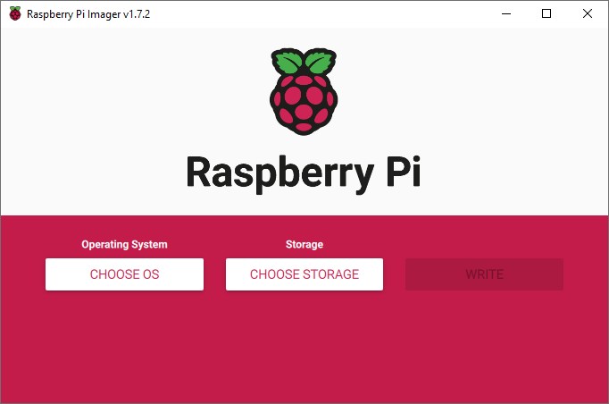
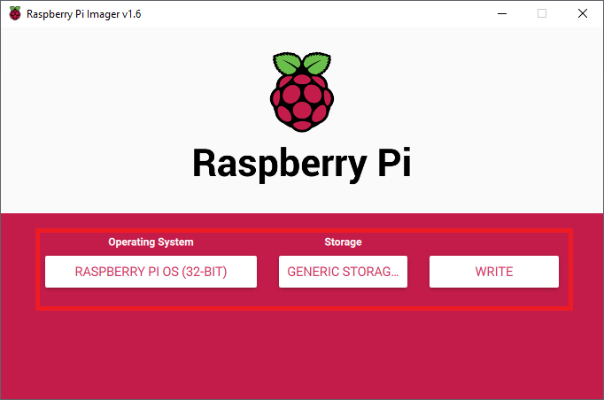
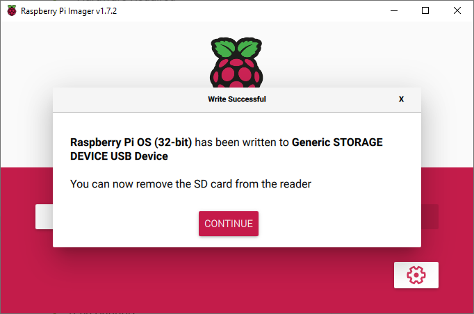
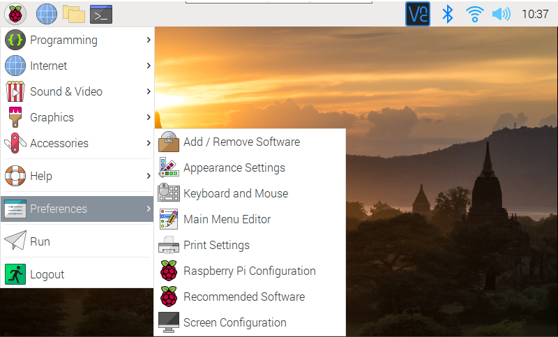
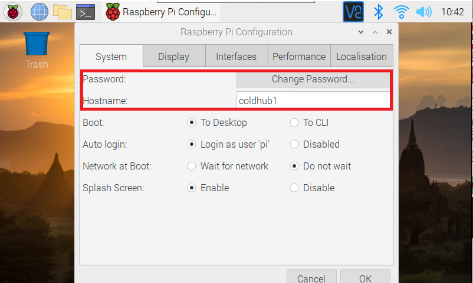
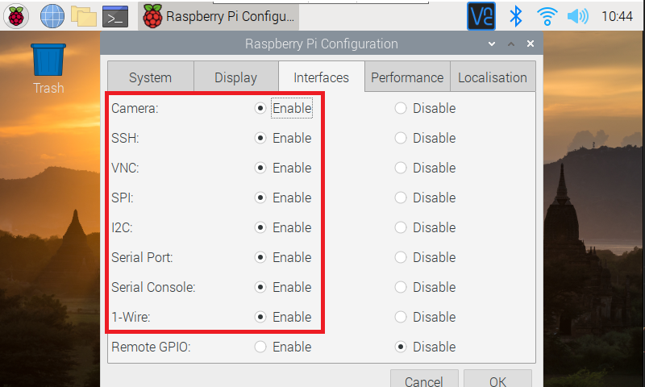
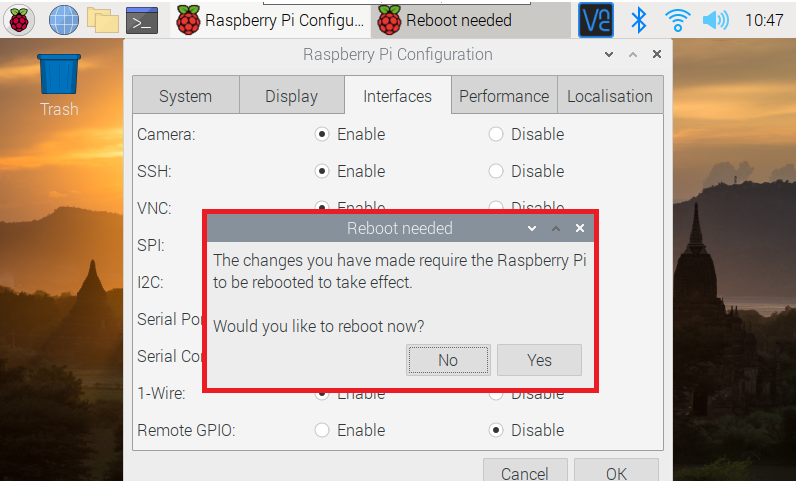

[](https://www.gnu.org/licenses/gpl-3.0)&nbsp;<a href="https://www.open-fermentation-project.org/"></a>&nbsp;<a href="https://apps.azureiotcentral.com/">
</a>&nbsp;<a href="https://www.saluminator.com/">
</a>


# Setting up the Raspberry Pi Environment

## Contents

- [Setting up the Raspberry Pi Environment](#setting-up-the-raspberry-pi-environment)
  - [Contents](#contents)
  - [Overview](#overview)
- [Setting up your Raspberry Pi OS](#setting-up-your-raspberry-pi-os)
  - [Introducing the Raspberry Pi Imager](#introducing-the-raspberry-pi-imager)
    - [Step 1 - Setup the Imager Tool](#step-1---setup-the-imager-tool)
    - [Step 2 - Choose the OS and SD Card](#step-2---choose-the-os-and-sd-card)
    - [Step 3 - Write the OS](#step-3---write-the-os)
    - [Step 4 - Eject the Micro SD card](#step-4---eject-the-micro-sd-card)
    - [Step 5 - Install the Micro SD card in the Raspberry Pi](#step-5---install-the-micro-sd-card-in-the-raspberry-pi)
  - [Configure the Raspberry Pi](#configure-the-raspberry-pi)
    - [Step 1 - Plug in a Keyboard and Mouse (or we can use the touchscreen)](#step-1---plug-in-a-keyboard-and-mouse-or-we-can-use-the-touchscreen)
    - [Step 2 - Open the Raspberry Pi Configuration](#step-2---open-the-raspberry-pi-configuration)
    - [Step 3 - Clone the "Open Fermentation Project" Repository](#step-3---clone-the-open-fermentation-project-repository)

## Overview

This document walks you through the setup of your Raspberry Pi environment for the Saluminator&reg;. 

Setup on your workstation involves configuring the development toolchain (everything that is needed to edit/iterate/build/deploy the software) and on the Raspberry Pi, the latest versions and the virtual environment for isolation of the Saluminator&reg; software when you are testing and running the applications.

**NOTE:** This is not a comprehensive and there are a number of issues you may encounter with versioning and other little nits. That is what the interwebs are for :)

# Setting up your Raspberry Pi OS
It is now time to set up the Raspbian image on the SD card that you load will into the MicroSD cart slot on the Raspberry Pi. Recently the Raspberry Pi Organization published an Operating System imaging tool that is excellent.

## Introducing the Raspberry Pi Imager
The first thing to set up is your Raspbian image on the SD card that you insert into the MicroSD cart slot on the Raspberry Pi. You will need at least a 8 gig card and the ability to I/O to the card using a SD reader.

### Step 1 - Setup the Imager Tool
[LINK: How to use Raspberry Pi Imager | Install Raspberry Pi OS to your Raspberry Pi (Raspbian)](https://www.youtube.com/watch?v=ntaXWS8Lk34)

Install the Imager tool for your Desktop operating system...

[LINK: Raspberry Pi OS Installation Page](https://www.raspberrypi.org/software/)

* Scroll the section, "Install Raspberry Pi OS using Raspberry Pi Imager"
* Install the **_Raspberry Pi Imager_** software for your operating system
* Next, fire up the **_Raspberry Pi Imager_** software...
 


* Press **CTRL+SHIFT+X** on the keyboard to open **Advanced options** window...
* Enable **Set Hostname:** and give your Pi a name you want (we use SaluminatorXX with a unique number of the appliance for easy identification).
* Enable **Enable SSH** and set the option to **Use password authentication**.
* Enable **Set username and password** to your preferences and something you can remember! **Hint:** Click the **Show password** option and insure it is all correct.
* Enable **Configure wireless LAN** and setup to your wireless network details.
* Enable **Set locale settings** to your time zone and preferred keyboard layout.
* Click the **SAVE** button!

### Step 2 - Choose the OS and SD Card

- Install the Raspbian OS Image on the SD card.
- Install the MicroSD card into the SD writer connected to your desktop or Laptop.
- Choose the "Raspberry Pi OS (32 Bit)" to install the whole OS and Desktop.

")

Choose the SD card connected to your computer.




### Step 3 - Write the OS

Click on the "WRITE" button and allow the process to copy, verify and complete.



### Step 4 - Eject the Micro SD card
Right-click on boot (on your desktop or File Explorer) and select the Eject option.

### Step 5 - Install the Micro SD card in the Raspberry Pi
<b>Note:</b> Turn off your Raspberry Pi!

Looking from the top of the RPi, install the SD card (the slot is on the bottom of the board) as shown in the picture below...


<b>CONGRATULATIONS</b> You have installed the Raspbian Operating System for the Raspberry Pi and are now ready to start setting things up for our ColdPack Monitoring Device.

## Configure the Raspberry Pi
Now that we have our SD card loaded with the Raspbian Operating System, we need to boot the Raspberry Pi and using the touchscreen, configure the system and the interfaces. After setting these things up we will be able to log into the Raspbery Pi from another computer and make it easier to program and run applications.

### Step 1 - Plug in a Keyboard and Mouse (or we can use the touchscreen)
We are going to configure the Raspberry Pi using a keyboard and mouse and this is the easiest way to get everything working well and verified.

### Step 2 - Open the Raspberry Pi Configuration
Open "References->Raspberry Pi Configuration"....



On the initial screen, set you password and the name of the instance. I like to use some numbering for my ColdHub pi's so that I can keep track as I test multiple devices...



Next, click the "Interfaces" tab and I set all of these to "Enable"...



Click "OK" and respond with "Yes" to reboot the Raspberry Pi and apply the configuration...



### Step 3 - Clone the "Open Fermentation Project" Repository
In this step we will clone the code and configuration scripts to the Raspberry Pi. Before we can pull the files from GitHub we need to setup our profile. Type the following commands into the terminal window to configure our Git Profile...

``` bash
git config --global user.name "Your Name"
git config --global user.email "your-email@example.com"
# Verify
git config --global --list
```

Type the following commands into the terminal window to clone the repository...

```bash
cd \
mkdir Projects
cd Projects
git clone https://github.com/Larouex/open-fermentation-project.git
cd open-fermentation-project
ls -l
```
You should see something similar to the following output...
```bash
total 84
drwxr-xr-x 1 larryj 1049089     0 Oct  3 13:47 assets/
drwxr-xr-x 1 larryj 1049089     0 Oct  3 13:45 assets-editing/
drwxr-xr-x 1 larryj 1049089     0 Mar 29  2022 cloud/
drwxr-xr-x 1 larryj 1049089     0 May 26 12:52 hardware/
-rw-r--r-- 1 larryj 1049089 35497 Mar 14  2022 LICENSE.md
-rw-r--r-- 1 larryj 1049089  6573 Oct  3 13:45 README.md
drwxr-xr-x 1 larryj 1049089     0 Oct 18 09:34 software/
```
