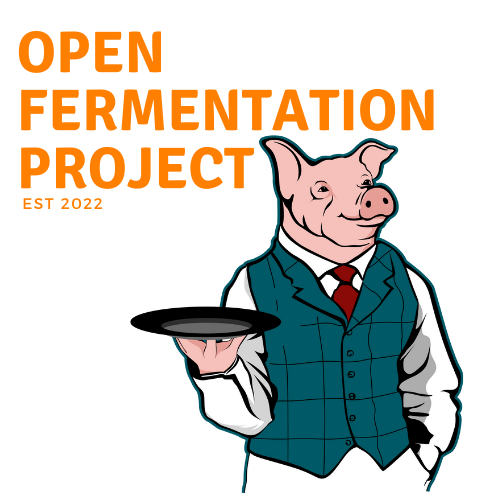

&nbsp;

## Contents

- [The Software (Overview)](#the-software)
  - [Recipe Phases](#recipe-phases)
    - [Incubation](#incubation)
    - [Curing](#curing)
    - [Finishing](#finishing)
  - [Managing Recipes](#managing-recipes)
  - [Recipe Parameters](#recipe-parameters)
    - [Temperature](#temperature)
    - [Temperature Variance](#temperature-variance)
    - [Temperature Run Time](#temperature-run-time)
    - [Temperature Idle Time](#temperature-idle-time)
    - [Humidity](#humidity)
    - [Humidity Variance](#humidity-variance)
    - [Humidity Run Time](#humidity-run-time)
    - [Humidity Idle Time](#humidity-idle-time)
    - [Cycle Time Toggle](#cycle-time-toggle)
    - [Cycle Time](#cycle-time)

# The Software

Recipes in the Saluminator are fixed with a starting time and a ending time. The time between is the “Recipe Cycle” and it can be as simple as one set of settings applied to the whole fermentation cycle or more complex with three(3) phases in the cycle automatically managed by the Saluminator’s automation software.

## Recipe Phases

As an example, take a classic Tuscan salumi that consists of three distinct phases...

- ### Incubation

  This is the very first phase the salumi goes through in order to kick the starter culture and begin the fermentation. This consists of higher heat and humidity usually between 8 to 12 hours.

- ### Curing

  This is the longest time in the salumi and is marked by a consistent temperature and humidity with constant air flow. The goal is remove 30% of the water weight from the salumi.

- ### Finishing

  The final stage that typically keeps the temperature and humidity low to achieve minimal moisture and weight loss. This is an optional phase and is used to cure a bit longer and if you desire a harder texture.

## Managing Recipes

Managing recipes using the Saluminator’s automation system you can easily create a Recipe Cycle and save it for the future and easily apply it to a current run of a recipe. You can also create and save your recipes on the salumi.cloud and retrieve them from the machine. When you create a phase in the Recipe Cycle, you set the following…

## Recipe Parameters

Recipe management in the Saluminator is controlled through the setting of Parameters in the system and you set the following per phase…

- ### Temperature

  The consistent “desired” temperature you want for the curing chamber. You measure the temperature inside your chamber and monitor the ambient temperature outside the chamber.

- ### Temperature Variance

  This is the amount of temperature variance before the Heater or the Chiller kick in. For example, if the Desired Temperature is 70 Degrees Fahrenheit and the Temperature Variance is set to 3, then the chiller will kick in at 73 Degrees Fahrenheit and the heater at 67 Degrees Fahrenheit.

- ### Temperature Run Time

  This is a “per minute” setting that you can tell a device to run for a designated length of time. You can achieve fine control of the amount of change you get from the heater and chillers to run them for a set period of time and then monitor and perfect the amount of change to get the desired result in the cure chamber.

- ### Temperature Idle Time

  This is a “per minute” setting that you can set for the time to wait between runs for a heater or chiller.

- ### Humidity

  The desired RH for the phase of the recipe. It is common to “incubate” a recipe with higher heat and humidity to kick the starter. Then lower it for the cure cycle and then lower even more for the finish cycle.

- ### Humidity Variance

  This is the amount of temperature variance before the humidifier or the dehumidifier kick in. For example, If the desired Humidity is 65 RH and the Humidity Variance is 3, then the dehumidifier will kick in at 68 RH and the humidifier at 62 RH.

- ### Humidity Run Time

  This is a “per minute” setting that you can tell a device to run for a designated length of time. You can achieve fine control of the amount of change you get from the humidifier and dehumidifier to run them for a set period of time and then monitor and perfect the amount of change to get the desired value in the cure chamber.

- ### Humidity Idle Time

  This is a “per minute” setting that you can set for the time to wait between runs for a humidifier or dehumidifier.

- ### Cycle Time Toggle

  Toggle between Hours or Days used to measure time (24 or 1).

- ### Cycle Time

  Set the number of days or hours for this phase.
